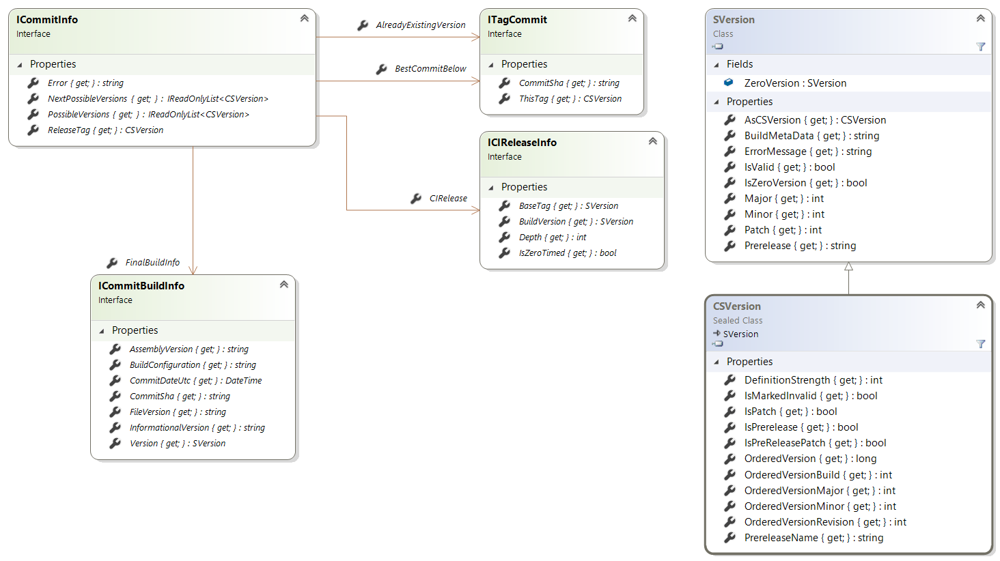

# SimpleGitVersion.Abstractions

This small assembly defines the minimal set of abstractions that enables to reason on new versions and configure a build.

It depends only on [CSemVer](https://www.nuget.org/packages/CSemVer/).

